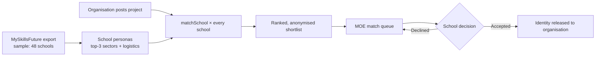

<div align="center">

# ✨ SparkVIA

**School-level matching for passion-based volunteerism**

A matching engine that sends every Values in Action (VIA) project to the MOE school whose students already care about it — scored the moment the project is posted.


[Quick Start](#-quick-start) · [How Matching Works](#-how-matching-works) · [Report a Bug](https://github.com/yjenexd/moe2030ReactorSchool-Spark2.0/issues)

</div>

---

## 😩 The Problem

VIA placements are usually matched one student at a time, or handed out to whichever school replies first. Organisations don't know which schools have students who actually want their kind of work. Schools get offers that land in exam season, need more supervisors than they have, or don't match what their students are interested in.

SparkVIA matches at the **school level** instead. It turns each school's MySkillsFuture interest data into a persona, then ranks every school for a project on interest, releasable headcount, supervision and the term calendar, before anyone sends an email.

## ✨ Features

🏫 **Schools Are Profiled, Not Students** — Each school's MySkillsFuture export is combined into a persona: its top 3 sectors by share of students, plus releasable headcount, VIA hours budget, teacher supervisors and exam blackout dates.

⚡ **Instant Ranked Shortlist** — When an organisation publishes a project, every school is scored on the spot. A live preview shows how many schools score 70+, how many students are interested, and whether the slots can be filled.

🕶️ **Anonymised Until Accepted** — Organisations see ranked candidates without school names or locations. They only learn who the school is once it accepts.

🗓️ **Calendar-Aware Scoring** — Project dates are checked day by day against each school's blackout dates (Prelims, End-of-Year exams, O- and A-Level papers, school events), so a clash lowers the score instead of turning up after the school has already said yes.

🧭 **MOE Routing Queue** — MOE admins see the full picture, forward each project to the best school, record the school's accept or decline, and send declined projects to the next candidate.

🗺️ **Network Interest Heat Map** — See each sector's share of every school's cohort across the network, and filter schools by persona sector or region.

🔍 **Explainable Scores** — Every candidate comes with a breakdown and plain-language flags such as *"Can fill all 40 slots"*, *"No first-aid trained staff"* or *"GCE O-Level written papers overlaps 6 days"*.

## 🚀 Quick Start

### Prerequisites

| Tool | Purpose |
|---|---|
| A modern browser | Runs the whole app — Chrome, Edge, Firefox or Safari |
| Git | Clone the repository |
| Python 3 or Node.js *(optional)* | Serve the page on `localhost` instead of opening the file directly |

### 1. Clone

```bash
git clone https://github.com/yjenexd/moe2030ReactorSchool-Spark2.0.git
cd moe2030ReactorSchool-Spark2.0
```

### 2. Run

Open the file directly:

```bash
open index.html        # Windows: start index.html
```

Or serve it locally:

```bash
python3 -m http.server 8080     # or: npx serve .
```

Then go to http://localhost:8080.

> [!NOTE]
> There is no build step, no backend and nothing to install. The data, matching engine, UI and both consoles all live in `index.html`. **All data is test data**: school figures are generated from a fixed seed, and every organisation is fictional.

> [!TIP]
> Your projects, forwards and school decisions are saved in your browser's `localStorage` under `sparkvia.v2`. Click **Reset demo** at any time to restore the seeded test data.

## 🛠️ Usage

Pick a role on the landing page.

**🏢 I'm an organisation**

```
1. Post a project     → title, MySkillsFuture sector(s), slots, VIA hours, dates, region, first-aid requirement
2. Preview your reach → schools scoring 70+, students interested, whether slots fill, calendar clear
3. Publish            → ranked, anonymised shortlist of candidate schools
4. Send to MOE        → track it: Shortlist ready → With MOE → With school → Accepted / Declined
```

**🏛️ I'm an MOE administrator**

```
1. Overview      → schools profiled, projects awaiting forwarding, acceptance rate
2. Schools       → each school's persona, full interest distribution, logistics and blackout dates
3. Interest map  → network heat map of share of cohort per sector
4. Match queue   → forward a project to a school, record its reply, forward declines to the next candidate
```

## 🧮 How Matching Works

Every school is scored out of 100 when a project is published:

```
score = 0.50·interest fit + 0.20·capacity + 0.15·supervision + 0.15·calendar
```

| Component | Weight | Full marks when… | Discounted when… |
|---|---|---|---|
| Interest fit | 50% | 55%+ of the cohort is interested in the project's sector (a secondary sector counts half) | — |
| Capacity | 20% | Students who are both interested and releasable number 2× the slots, leaving room for drop-outs | The school's VIA hours budget is below the project's hours (×0.6) |
| Supervision | 15% | 1 teacher supervisor per 15 students | First aid is required but no first-aid trained staff are available (×0.6) |
| Calendar | 15% | No project day overlaps an exam or event | In proportion to the clashing days |

Region isn't part of the score. It's shown to MOE as extra context for proximity.

To tune the engine, edit these constants in `index.html`:

```js
const W = {interest:.50, capacity:.20, supervision:.15, calendar:.15};
const FULL_INTEREST_PCT = 0.55;
const CAPACITY_HEADROOM = 2;
const STUDENTS_PER_SUPERVISOR = 15;
```

## 🏗️ Architecture

One file with three parts: **seed data** (schools, organisations, projects), a **matching engine** made of pure functions, and a **render layer** that redraws the current view from a single state object saved to `localStorage`.



## 🧰 Tech Stack

| Layer | Stack |
|---|---|
| Frontend | HTML · CSS (custom properties, `color-mix`) · Vanilla JavaScript |
| Typography | Bricolage Grotesque · Instrument Sans · JetBrains Mono (Google Fonts) |
| Data | Seeded in-file test data: 48 MOE schools, 14 MySkillsFuture sectors, 2026 term calendar |
| State | Browser `localStorage` |
| Hosting | Any static host (e.g. GitHub Pages or Vercel) |

## 🩺 Troubleshooting

| Symptom | Fix |
|---|---|
| Edits to seed data don't show up | Old state is still saved — click **Reset demo** or clear site data |
| State resets on every reload | Private/incognito windows block `localStorage`; use a normal window |
| Fonts look plain | Google Fonts didn't load (e.g. offline) — the app falls back to system fonts and still works |
| Blank page | Open the browser console (`Cmd+Option+J` / `Ctrl+Shift+J`) and check for JavaScript errors |

## 🤝 Contributing

- Branch off `main` with a descriptive name (`feat/...`, `fix/...`).
- Keep commits atomic, and write PR titles that summarise intent.
- If you change the matching engine, update the in-app "How is compatibility scored?" panel and the table above so they match.
- No direct pushes to `main`; all changes go in through a reviewed Pull Request.

---

<div align="center">

Built for **MOE EduTech 2030** · Built with Claude

[GitHub](https://github.com/yjenexd/moe2030ReactorSchool-Spark2.0)

</div>
